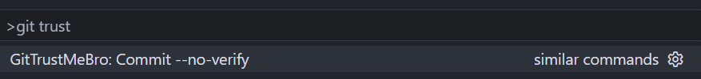
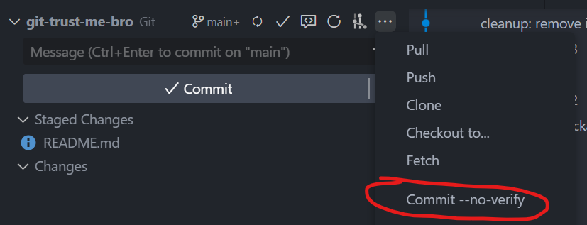

# GitTrustMeBro

**Skip Git hooks with style. Commit `--no-verify` directly from VSCode. Trust me bro, I know what I’m doing.**

## 🚀 What is GitTrustMeBro?

`GitTrustMeBro` is a lightweight VSCode extension that adds quick actions to **commit** your code using the `--no-verify` flag — bypassing Git hooks like linters, tests, or any custom scripts that would normally block the action.

It's perfect for those moments when you just *know* what you're doing, and need to get the job done fast.

## ⚙️ Features

- Commit with `--no-verify` from the command palette or button
- Avoid those annoying hook-related blocks when you're sure your code is fine
- Works seamlessly with your existing Git setup in VSCode

## 🧩 Why?

Git hooks are great. They catch bugs and enforce standards.  
But sometimes... you just need to bypass them. Maybe:
- You're working on a WIP branch
- The hook is failing for the wrong reasons
- You just need to ship now and fix later

That’s where **GitTrustMeBro** comes in.

## 🛠️ Installation

1. Go to the [VSCode Marketplace](https://marketplace.visualstudio.com/) and search for `GitTrustMeBro`
2. Click **Install**
3. Done!

## 💡 Usage

- Open the Command Palette (`Ctrl+Shift+P` or `Cmd+Shift+P`)
- Type `GitTrustMeBro: Commit --no-verify`
- Alternatively, use the buttons in the Source Control panel

## 📸 Screenshots

Command palette command

Source control commit button

---

Made with ❤️ and no hooks.